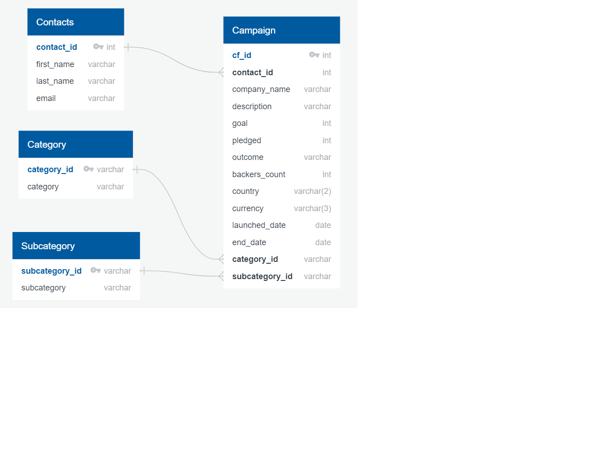
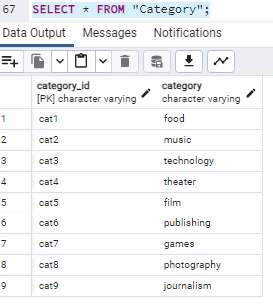
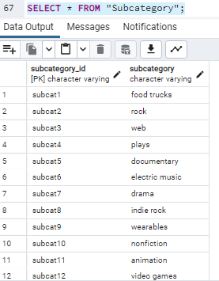
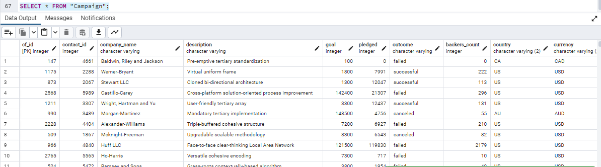
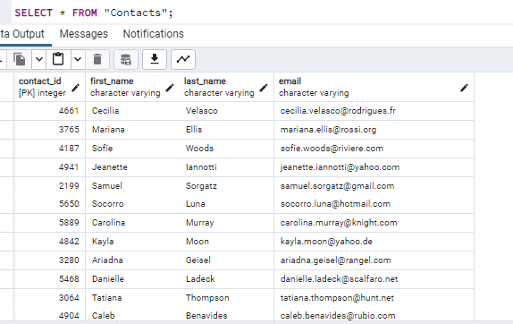

# Crowdfunding_ETL

##### Authors: Jennifer Kim, Kat McEldowney, and Scott Zuckerbrow

## Background
The aim of this project was to build an ETL (Extract, Transform and Load) pipeline using crowdfunding campaign and business contact information data.

## Methods
The original data were imported from two Excel files (`crowdfunding.xlsx` and `contacts.xlsx`) into a Jupyter Notebook called `ETL_Mini_Project_JKim_KMcEldowney_SZuckerbrow.ipynb`. We created four different DataFrames in this starter code—Category, Subcategory, Campaign and Contacts.

The data were extracted, cleaned and organized using Python’s Pandas, NumPy and Datetime libraries. The UTC times were converted into the local date time format. We used regular expressions (regex) to extract the category and subcategory titles. For the Contacts DataFrame, we could choose either Pandas or regex to extract the contacts’ ID numbers, names and email addresses but decided to use both methods. We exported the DataFrames into CSV files to be imported into Postgres.

Our final product was a relational database of four tables in Postgres called `crowdfunding_db`. We drew an ERD on QuickDBD and exported the SQL code that came with primary and foreign keys and relationship links that we set up for the tables. We ran this code in Postgres to create and prepare tables for importing data. Finally, we brought in the data from CSV’s into their respective SQL tables.

## Results
Here is an ERD of our table schema:

 
The screenshot images below show the tables in Postgres after a `SELECT *` statement for each.

There were 9 distinct categories and 24 subcategories in this crowdfunding dataset:

 

The Campaign table lists companies and their crowdfunding campaign goals and performance metrics.

The following table is a directory of contacts.

